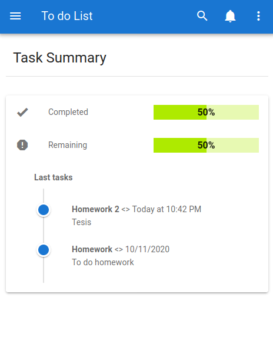
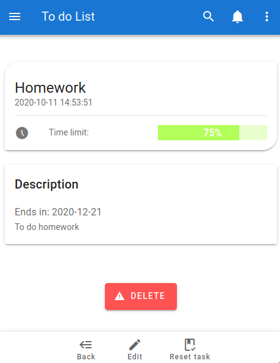
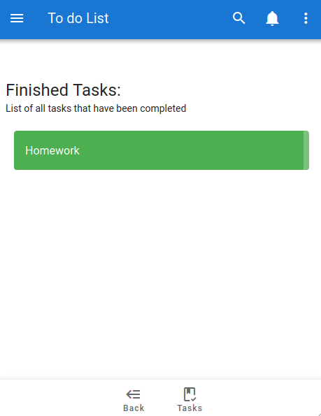

# to-do-list

    "To do list" application, with vuetify, push messages, notifications, monitoring of tasks and user lists

Demo [To do list](https://gallant-bell-8fb1b9.netlify.app)

### Install

> git clone https://github.com/GiancarloAparicio/To-do-list-Vuetify-PWA.git
>
> cd to-do-list
>
> npm install && npm run serve <> http://localhost:8080 (Default)

### Preview

Icons designed by[DinosoftLabs](https://www.flaticon.es/autores/dinosoftlabs)

Image designed by [Mark Michaelis](https://pixabay.com/es/users/thragor-1768456/?utm_source=link-attribution&utm_medium=referral&utm_campaign=image&utm_content=5649893)
